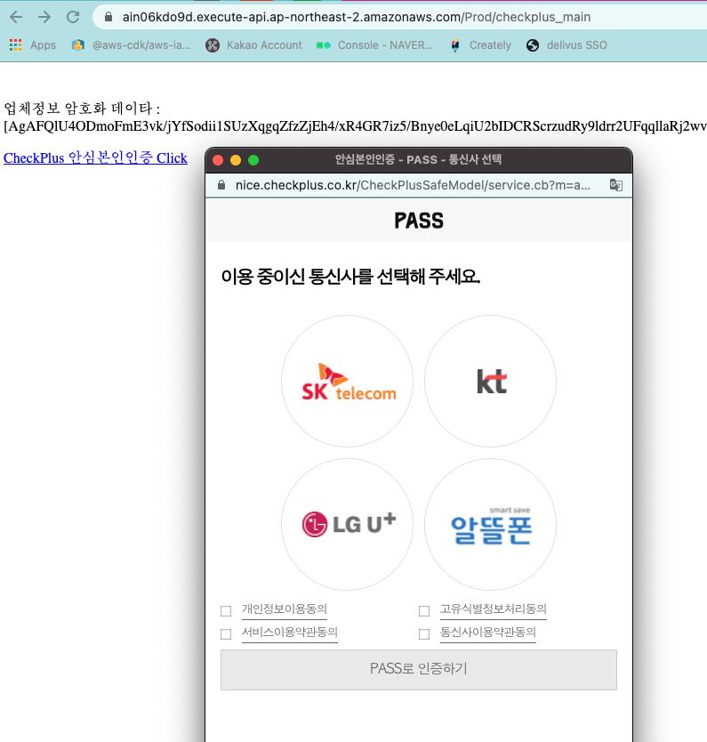

# Serverless nice 체크 플러스


[NICE 안심본인인증](https://www.niceid.co.kr/prod_mobile.nc) 서비스 AWS SAM을 이용해 lambda로 바로 배포할 수 있는 패키지입니다

기본적으로 업체에서 제공하는 샘플코드를 바로 사용할 수 있게 패키징했습니다. 
Python flask 사용합니다. 

세부적인 코드 및 설정은 [개발가이드](resources/guide_PY_V1.3_.pdf) 참고바랍니다.

# 환경설정 
아래부터는 MAC에서 설치및 배포 방법을 설명합니다
윈도우등 다른 OS에서는 [AWS SAM 문서](https://docs.aws.amazon.com/ko_kr/serverless-application-model/latest/developerguide/serverless-sam-cli-install.html)를 참고하세요.

## AWS SAM
```
/bin/bash -c "$(curl -fsSL https://raw.githubusercontent.com/Homebrew/install/master/install.sh)"
brew tap aws/tap
brew install aws-sam-cli

```

## AWS 자격증명 설정
AWS 계정이 필요함
[설정 문서참조](https://docs.aws.amazon.com/ko_kr/serverless-application-model/latest/developerguide/serverless-getting-started-set-up-credentials.html)

```
$ aws configure
AWS Access Key ID [None]: your_access_key_id
AWS Secret Access Key [None]: your_secret_access_key
Default region name [None]: 
Default output format [None]: 
```

## python env 
```
curl https://pyenv.run | bash
exec "$SHELL" 
pyenv install 3.8.8
pyenv virtualenv 3.8.8 nice-checkplus
pyenv activate nice-checkplus를
pip install -r checkplus/requirements.txt 

```

## 빌드 및 배포
빌드
```
sam build
```
로컬 테스트
```
sudo chmod 755 checkplus/CPClient_64bit 
sam local invoke -e events/event.json       

```

배포


```
sam deploy --guided
```
배포 설정은 다음을 참조한다.


## 배포후 환경 설정
배포가 완료되면 Output의 `NiceCheckPlusHostURL` 의 host URL을 복사한다. 


AWS console을 접속해서 배포를 확인한다.


AWS 콘솔의 lambda > configuration > environment에서 환경 변수를 설정한다.
- API_GATEWAY_URL: 위에서 복사한 `NiceCheckPlusHostURL`의 값을 넣는다. (끝 `/` 포함)
- SITE_CODE: 계약시 제공받는 값
- SITE_PASSWORD: 계약시 제공받는 값


## 확인
브라우저를 열고 `NiceCheckPlusHostURL`/checkplus_main 으로 이동한다.(예제에서는 https://ain06kdo9d.execute-api.ap-northeast-2.amazonaws.com/Prod/checkplus_main)



성공결과
